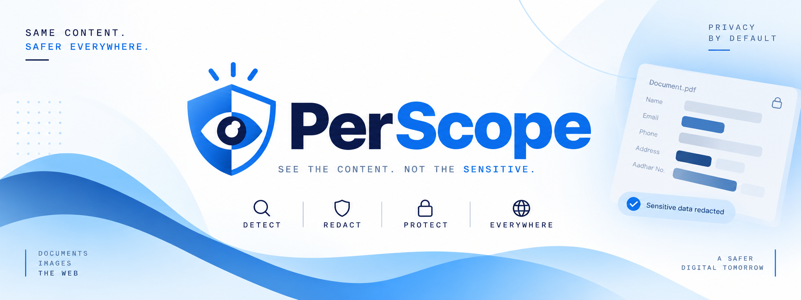
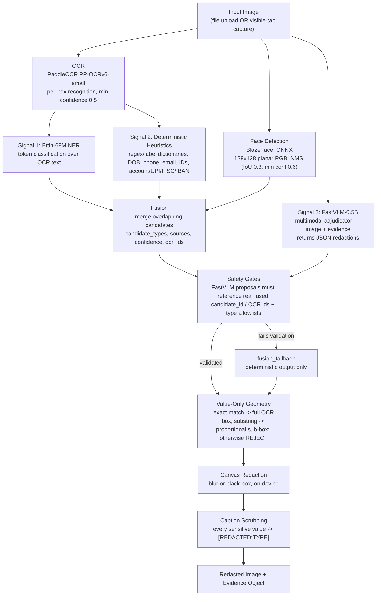

<p align="center">
  
</p>

# PerScope — See everything. Leak nothing.

> **SIH26171 — On-device Visual Perception for Light-weight Browser Agents**
> Organization: ISRO / Department of Space · Category: Software · Theme: Smart Automation

> This document reflects the **Final Architecture Overview (Team Cosmic Crux)** and supersedes all earlier drafts (Moondream/SmolVLM, OpenRedaction-only, agent-only framing, and the DOM + Florence-2 + Qwen tiered-escalation plan).

## 0. Status — What's Tested vs. What's Still Planned

This reflects a **real, working, tested prototype** — not just a plan. The perception and redaction pipeline below matches what was implemented and verified end-to-end (Chrome MV3 extension + a Node.js reference implementation kept in 1:1 algorithmic parity). **Read the perception/redaction sections as ground truth. Read the server/action sections as intended design, not yet built.**

| Layer | Status |
|---|---|
| Perception (face + OCR detection) | **Tested, working** — BlazeFace + PaddleOCR, both ONNX, both on-device |
| PII detection & fusion | **Tested, working** — three independent signals fused with confidence scoring |
| Redaction (value-only geometry + canvas rendering) | **Tested, working** — most mature, most validated part of the system |
| Safety gates / fail-closed behavior | **Tested, working** — unvalidated model output falls back to deterministic output, never blind trust |
| Action validator / confirm flow / dashboard logging | **Planned** — no WebSocket client, no tool-schema execution, no `content.js` action layer in the tested build |
| Server-side reasoning / MCP bridge / Playground | **Planned** — tested build is the local perception+redaction module only; nothing transmits sanitized context to any server yet |
| DOM-based extraction | **Superseded** — tested pipeline works on images (screenshots / uploads), not the live DOM |

## Core Principle

> **We change content, not structure — structure, semantics, and relationships remain intact. Only sensitive values are replaced.**

Tested-prototype reading: layout, non-sensitive content, and page appearance stay fully visible; only the pixel regions holding a sensitive **value** are blurred/blacked out. Value-only, never whole-line — `Account Number:` stays visible, only the number is covered.

## Overview

PerScope is a **local, zero-trust perception and redaction layer** between any webpage and any AI — agent or human. It is not an agent and not a browser automation script. It is a **tool-server**, reachable four different ways, that guarantees nothing sensitive leaves the device unredacted and nothing destructive executes without passing a local validator.

The local pipeline (perception → PII fusion → redaction) is **tested and working**. What comes after — sending sanitized output to a server that reasons freely and calls back into the extension to act — is the intended design (see Architecture → Server Reasoning / Action Validation) but **not yet built**. Once built: the server reasons over sanitized data however it wants; the extension is the only thing with permission to touch the real DOM; the only check after the server decides is whether that specific action is destructive.

### Four Consumption Modes

All four speak the identical `{id, tool, params}` schema into the identical local validator. The extension cannot tell them apart — that is the point.

| Mode | Who is calling | Status |
|---|---|---|
| **PerScope Reasoning Server** | Self-hosted open-weight LLM/VLM — model not yet chosen (explicitly **not** Qwen) | **Required — PS deliverable, not yet built** |
| **Real MCP Agent** | Claude Code / Codex via auto-launched, zero-logic MCP bridge | Bonus — proves protocol compatibility |
| **Demo Playground** | Manual simulated agent (same WebSocket schema) | Demo / observability console |
| **Manual query / Send to Chat** | The user directly, no agent — sanitized description to paste or auto-send into any chatbot | Differentiator — works with zero agent installed |

## Two Products, One Pipeline

| Product | How it works |
|---|---|
| **Human Mode** | Person, no agent installed, uses the extension directly to safely show a page to whatever AI chat they already have open. Primary surface most users will touch. **Planned UI — not in the tested build.** |
| **Agent Mode** | Autonomous reasoning system (PerScope's own server or a real MCP agent) drives the extension programmatically via the tool schema. **Action layer planned — not in the tested build.** |

### Human Mode — Popup UI and Capture Flow (planned)

- **Tab selector** (defaults to current tab) + single **Capture** button + always-visible **"Privacy protected ✓"** indicator.
- **Live progress:** page captured → text extracted → sensitive information detected → sanitizing, with *"Everything stays on this device."*
- **Capture Review screen (required, before anything is sent):** Visual view (screenshot with masked regions in place) + Context view (structured semantic representation, e.g. `User: [PERSON]`, `Email: [EMAIL]`). Outcome states: **Clean** / **Ambiguous** (fail-closed, user reviews) / **Blocked** (does not proceed until reviewed).
- **Send to Chat — two actions:** **Send** (injects into chat input only — safer default) vs **Send & Submit** (injects + submits, explicit opt-in). Destination auto-detects known AI-chat tabs; injection executes through `content.js`. Content is **wrapped, not dumped raw**, with a short explanatory header so the destination AI understands `[PERSON]`/`[EMAIL]`/`[REDACTED:TYPE]` placeholders.

### Chat Destination & Injection Layer (planned)

First-class component alongside the extension components: tab discovery, per-site adapters (ChatGPT/Claude/Gemini input-box selectors), Send / Send & Submit distinction. Executes through `content.js`; no second DOM path. See Architecture below.

## Architecture

### End-to-End Flow — As Tested

Every model runs on-device — WebGPU with WASM/CPU fallback, no cloud calls.



What is **not** yet part of this tested flow: transmission to any server, tool-schema execution, browser actions. The "sanitized context crosses a trust boundary" stage is the intended next step, not yet built.

> **Methodology:** 1 Capture image → 2 Detect (BlazeFace + PaddleOCR + Ettin-68M + heuristics + FastVLM-0.5B, fused) → 3 Validate (safety gates, fail-closed fallback) → 4 Redact value-only regions (canvas) + scrub captions → 5 Emit redacted image + evidence (stays on device until the server/action layer lands).

```
Trust boundary (intended, not yet wired):  Sanitized Context  ===  Server LLM/VLM
Everything above === runs on-device today; raw image/PII never leave the device.
```

### Detection — Parallel Fusion, Not Sequential Escalation

Supersedes the old "pyramid of tiers" (regex → NER → Qwen escalation). All three signals run on the same input and are merged/cross-validated; the multimodal model's output is a **proposal to be checked**, not a gate. Even if FastVLM fails, deterministic + NER signals are never blocked by that failure.

**Why redaction can't hallucinate:** FastVLM proposals are validated against real fused `candidate_id`s / OCR ids + type allowlists; failures fall back to deterministic + NER fusion alone. The model is never the last word.

**Value-only geometry (single chokepoint):** exact match → full OCR box; substring → proportional sub-box with whole-line guards; anything not proven value-specific is **rejected** rather than over-redacted. Direct answer to the PS "precision of redaction" criterion (20%).

**Face redaction — previously an open gap, now solved and tested** via BlazeFace feeding the same redaction pipeline.

### Extension-Side Components

Status marked per row — tested prototype is `popup.html`/`dashboard.html` → `background/service-worker.js` → `offscreen.html`/`offscreen.js` → `src/pipeline/` → `src/popup/`.

| Component | Responsibility | Status |
|---|---|---|
| `background.js` / service worker | WebSocket client (outbound only), 20s keepalive, routing, `isDestructive()`, pending-action map + confirm flow | **Planned** — tested SW manages offscreen lifecycle + tab capture only |
| `offscreen.js` | Hosts on-device models via Transformers.js/ONNX Runtime Web, WebGPU + WASM fallback | **Tested — BlazeFace, PaddleOCR, Ettin-68M NER, FastVLM-0.5B** (idle pre-warm of NER + FastVLM). No Qwen 2B, no Florence-2, no DOM extraction |
| `content.js` | Only live-DOM access — captures state, executes validated actions | **Planned** — tested pipeline works on images, not live DOM |
| Side panel | Live view + Approve/Deny prompt | **Planned** — tested equivalent is the dashboard bbox-overlay review UI |
| Dashboard | Privacy Log + Security Log, redacted-only storage, Clear All | **Partially tested** — tested dashboard shows telemetry, caption/evidence/prompt panes, PNG/JSON export; two-log structure not yet built |
| Popup | Tab selector + Capture, Review, Send / Send & Submit | **Partially tested, different shape** — tested popup has upload/capture-tab, device tier, style toggles, progress steps; no Send-to-Chat yet |
| Chat Destination & Injection Layer | AI-chat tab discovery, per-site adapters, injection via `content.js` | **Planned** |

Manifest: `minimum_chrome_version: 116` for the future WebSocket keepalive; tested MV3 manifest loads ONNX Runtime WASM from `chrome.runtime.getURL("ort/")` (not CDN) to satisfy MV3 CSP. **Chrome-only**; no Firefox claim without testing.

### Action Validation & Confirm Flow (planned — design locked, not built)

```
Caller (Server / Agent / Playground) -> {id, tool: "click", params} -> background.js -> isDestructive()
  ├─ not destructive → content.js executes → {id, status: "ok"}
  └─ destructive → {id, status:"blocked", reason, pending_id} + side panel Approve/Deny
       ├─ approve → content.js executes → {type:"action_update", pending_id, status:"ok"}
       ├─ deny    → {type:"action_update", pending_id, status:"denied"}
       └─ 60s timeout → {type:"action_update", pending_id, status:"timeout"}
```

Same check whether the click came from the legitimate caller or hidden white-on-white page text — the validator evaluates what the action *would do*, not where the instruction came from. That is the entire prompt-injection defense.

### Server-Side Reasoning — Requirement, Not Demo Convenience (planned — model not chosen)

PS requires transmitting sanitized context to a centralized LLM/VLM and receiving actionable commands back using an **open-source/open-weight model**. Cloud hosting is permitted only as a hosting convenience during the event.

- **Model: not yet chosen — explicitly not Qwen** (too heavy for the budget that drove the FastVLM-0.5B on-device choice). Open-weight LLM/VLM, self-hostable via vLLM or Ollama. Genuinely open decision.
- **Output contract:** constrained to the tool schema (`read_page`, `list_interactive_elements`, `click`, `type`, `submit`, `select_option`, `scroll`) via structured/function-calling output — never free-form prose.
- **Multi-turn:** terminal UI action or request for more evidence (`scroll` then re-evaluate).
- **Validator applies identically** to PerScope's own server — defends against its own model proposing a bad action, not only hostile pages.

## Tech Stack

**Confirmed, tested (perception + redaction module):**

| Layer | Technology | Status |
|---|---|---|
| Extension shell | Chrome MV3 (popup, background SW, offscreen document, dashboard) | Tested |
| Face detection | BlazeFace ONNX (`garavv/blazeface-onnx`), ~0.5 MB | **Tested — closes the "blurring faces" gap** |
| OCR | PaddleOCR PP-OCRv6-small (det + rec), per-box recognition, min conf 0.5 | Tested |
| PII candidates (NER) | Ettin-68M-Nemotron-PII ONNX (`rulesentry-io/ettin-68m-nemotron-pii-onnx`), WebGPU pinned, single-thread WASM fallback | Tested |
| PII candidates (rules) | Regex/label dictionaries (DOB, phone, email, IDs, account/UPI/IFSC/IBAN…) | Tested |
| Multimodal adjudication | FastVLM-0.5B ONNX (`onnx-community/FastVLM-0.5B-ONNX`), WebGPU pinned, greedy decode — **replaces Florence-2-base and Qwen 2B** | Tested |
| Redaction rendering | Canvas (OffscreenCanvas), blur or black-box | Tested |
| On-device runtime | `onnxruntime-web` + `@huggingface/transformers` v4, WebGPU pinned per model, WASM/CPU fallback | Tested |
| Node reference | `v7.mjs`-class reference impl, 1:1 algorithmic parity with browser pipeline | Tested (parity reference) |

**Retired:** Florence-2-base, Qwen3.5-2B (may exist in `models/` but inactive); DOM-based extraction (superseded by image capture); Qwen dropped server-side too.

**Planned:** WebSocket transport + MCP bridge (stdio ⇄ WebSocket); server-side model (open, non-Qwen, via vLLM/Ollama); `isDestructive()` validator + side-panel confirm; per-site chat adapters.

## Feasibility Snapshot

- **Technical:** ONNX Runtime Web + Transformers.js v4 + WebGPU/WASM run BlazeFace, PaddleOCR, Ettin-68M, FastVLM-0.5B inside a standard Chrome extension — verified end-to-end.
- **Economical:** Open-weight models, no licensing cost; on-device inference cuts server compute.
- **Social:** PII stays on-device; Send-to-Chat (planned) works with zero agent installed.
- **Legal:** Raw image/PII never leave the device; offline self-hosted server path satisfies data-sovereignty.
- **Operational:** MV3 install; dashboard evidence/PNG-JSON export today, Privacy/Security Logs + Approve/Deny planned.
- **Security:** Safety gates + `fusion_fallback` + caption scrubbing (tested) + uniform `isDestructive()` validator (planned) cover hostile pages *and* model mistakes.

## Known Limitations (tested — state proactively)

- FastVLM-0.5B is small: captions can be bland, occasionally misses the JSON schema — pipeline survives via fallback, richness bounded by capacity.
- Heuristics can over-redact at edges (e.g. number row inheriting nearby label context) — safe-direction tradeoff, not perfect precision.
- WASM fallback is single-threaded (int64 inputs crash the threaded build) — CPU inference of larger models is slow; demo on WebGPU-capable hardware.
- Server model, action layer, Send-to-Chat, per-site adapters: not built — demo honestly as "local perception + redaction, tested" + "planned server/action layer".

## Research and References

- Transformers.js Chrome Extension — `huggingface.co/blog/transformersjs-chrome-extension` — offscreen documents + WebGPU pattern.
- PaddleOCR.js — `github.com/PaddlePaddle/PaddleOCR/blob/main/docs/version3.x/inference_deployment/cross_platform/browser.en.md` — ONNX Runtime + WASM/WebGPU in-browser OCR.
- Ettin-68M-Nemotron-PII ONNX — `huggingface.co/rulesentry-io/ettin-68m-nemotron-pii-onnx` — edge-optimized token classification.
- BlazeFace ONNX — `huggingface.co/garavv/blazeface-onnx` — lightweight face detection (~0.5 MB).
- FastVLM-0.5B ONNX — `huggingface.co/onnx-community/FastVLM-0.5B-ONNX` — on-device multimodal adjudication.
- safeclipper — `github.com/AFK-surf/safeclipper` — local OCR + bbox image redaction.
- PrivacyLens — `github.com/shitijkarsolia/privacylens` — PII redaction with pre-send review.
- MCP — `modelcontextprotocol.io/specification/2025-06-18/architecture`.

## Repository Structure

```
/extension
  /background        # background.js / service worker — tested: offscreen lifecycle + capture; planned: WS client + validator
  /offscreen         # offscreen.js — TESTED: BlazeFace + PaddleOCR + Ettin-68M + FastVLM-0.5B
  /content           # content.js — planned (live-DOM + chat injection)
  /sidepanel         # planned (Approve/Deny)
  /dashboard         # tested: telemetry/evidence/export; planned: Privacy + Security logs
  /popup             # tested: upload/capture/device-tier/progress; planned: Capture Review + Send
  manifest.json      # MV3, min Chrome 116, local ORT WASM via chrome.runtime.getURL("ort/")
/server              # PerScope Reasoning Server — PLANNED (model TBD, non-Qwen)
/bridge              # MCP stdio<->WebSocket bridge — PLANNED
/playground          # Demo WebSocket client/UI — PLANNED
/docs
  architecture.md    # v4 — tested pipeline ground truth + planned server/action design
  tool-schema.md     # 7-tool schema (planned action layer — unchanged contract)
  security-model.md  # gates + fallback + caption scrubbing (tested) + validator (planned)
  limitations.md     # honest tested limits
  build-order.md     # perception/redaction done → server/action next
README.md
LICENSE
.gitignore
```

> Historical Node reference scripts (`v3.mjs` — Florence-2 + Qwen pipeline, `qwen_redaction_pure.mjs`, `QWEN_REDACTION_PIPELINE_PLAN.md`) are **superseded** by the tested BlazeFace + PaddleOCR + Ettin + FastVLM-0.5B parallel-fusion pipeline. Kept for record; do not build against them.

## Team

**Cosmic Crux — SIH26171**

| Area | Ownership |
|---|---|
| Extension / Automation | Extension/Automation |
| Perception | Perception |
| Privacy / Redaction | Privacy/Redaction |
| Server / Bridge / Playground | Server/Bridge/Playground |
| Research / QA | Research/QA |

> Member names and detailed task breakdowns are tracked under `/docs/tasks/<role>.md`.

## Status

Local perception + redaction: **tested end-to-end**. Server reasoning + action layer + Human Mode Send-to-Chat: **planned**. For full detail see:

- [`/docs/architecture.md`](/docs/architecture.md)
- [`/docs/tool-schema.md`](/docs/tool-schema.md)
- [`/docs/security-model.md`](/docs/security-model.md)
- [`/docs/limitations.md`](/docs/limitations.md)

## License

MIT — see [LICENSE](LICENSE).
