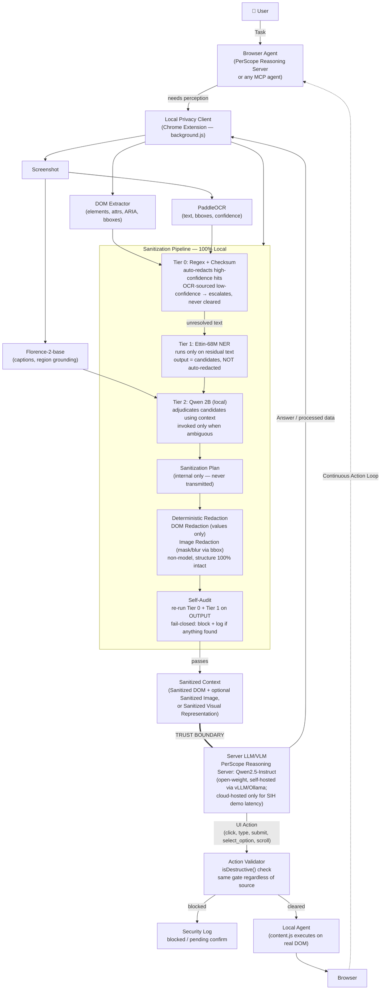
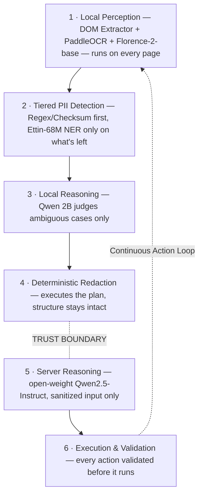
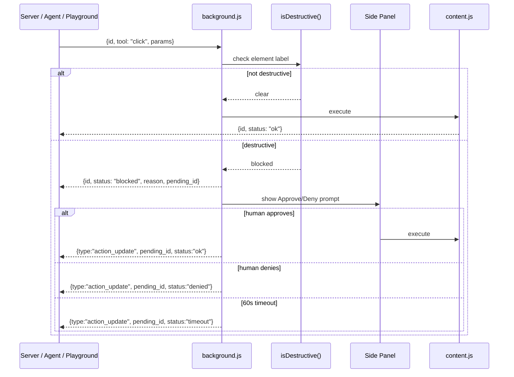

# PerScope — Final Architecture Overview
### SIH26171 — Team Cosmic Crux — On-Device Visual Perception Tool-Server for Browser Agents

This document consolidates every architectural decision made across design iterations into one reference. It supersedes all earlier drafts (Moondream/SmolVLM version, OpenRedaction-only version, agent-only framing).

---

## 1. Core Principle

> **"We change content, not structure. Structure, semantics, and relationships remain intact. Only sensitive values are replaced."**

Everything else in this document is a consequence of that one sentence.

---

## 2. What PerScope Actually Is

PerScope is a **local, zero-trust perception and redaction layer** that sits between any webpage and any AI — agent or human. It is not "an agent." It is not "a browser automation script." It is a tool-server, reachable four different ways, that guarantees nothing sensitive ever leaves the device unredacted, and nothing destructive executes on the page without passing a local validator — regardless of who or what is asking.

**In plain terms:** the local pipeline (perception → tiered detection → Qwen 2B reasoning → deterministic redaction) decides what's sensitive and removes it — that's the only thing PerScope constrains. Once that redacted/sanitized context is sent to the server, the server-side agent (PerScope's own Qwen2.5-Instruct, or a real MCP agent) reasons over it completely freely — it decides the task, the plan, and what to do next however it wants. PerScope never limits *how* the server thinks. When the server decides an action is needed on the page — click, type, submit, scroll, whatever — it calls back into the extension to actually perform it; the extension is the only thing with permission to touch the real DOM, so the server can decide but can never act directly. The only thing still checked, after the server decides, is whether that specific action is destructive — that check happens locally, on the resulting action, not on the server's reasoning itself.

### The four consumption modes

| Mode | Who's calling | Status |
|---|---|---|
| **PerScope Reasoning Server** | Self-hosted open-weight LLM (Qwen2.5-Instruct) that PerScope itself operates | **Required** — this is the actual PS deliverable |
| **Real MCP Agent** | Claude Code / Codex, via the auto-launched, zero-logic MCP bridge | Bonus — proves protocol compatibility, not a substitute for #1 |
| **Demo Playground** | Person 5's manual simulated agent (same WebSocket schema) | Demo/observability console, not the reasoning source |
| **Manual query / Send to Chat** | The user directly, no agent at all — gets a sanitized description to paste or auto-send into any chatbot | Differentiator — works with zero agent installed |

All four speak the identical `{id, tool, params}` schema into the identical local validator. The extension cannot tell them apart, and that's the point.

---

## 3. Two Products, One Pipeline

Everything from Section 2 onward describes one local pipeline with **two front doors**, and both need to be documented as first-class, not one primary and one implied:

- **Human Mode** — a person, no agent installed, uses the extension directly to safely show a page to whatever AI chat they already have open. This is the primary product surface most users will actually touch.
- **Agent Mode** — an autonomous reasoning system (PerScope's own server, or a real MCP agent) drives the extension programmatically via the tool schema, as described in the rest of this document.

Both terminate in the same local pipeline (perception → tiered detection → deterministic redaction → self-audit) and the same trust boundary. Human Mode is not a simplified version of Agent Mode — it's the same guarantee, with a person instead of a model deciding when to invoke it and where the sanitized result goes.

### 3.1 Human Mode — Popup UI and Capture Flow

This is the part that was previously undocumented. The popup is not just "toggle, stats, link to dashboard" — its primary job is the **Capture** action.

**Popup, default state:**
- A **tab selector** — lets the user pick which open tab PerScope should capture. Defaults to the current tab, but the user can pick any other open tab.
- A single **Capture** button. Not "Analyze," "Scan," "Redact," or "Perceive" — those are implementation concepts. The user's mental model is "capture this page," nothing more.
- A small "Privacy protected ✓" trust indicator, always visible.

**On Capture, the popup shows live progress** as the existing pipeline runs, reusing the same stages already defined elsewhere in this document — page captured → text extracted → sensitive information detected → sanitizing — with a persistent line reinforcing the trust boundary: *"Everything stays on this device."*

**After processing — the Capture Review screen (new, required):** the sanitized result is shown to the user *before* anything is sent anywhere. This is the single most important addition to the human-facing flow: PerScope doesn't say "trust us," it shows exactly what would be transmitted. Two views of the same capture:
- **Visual view** — a screenshot-style representation with sensitive regions masked in place.
- **Context view** — a structured, semantic representation of what will actually be sent (e.g. `User: [PERSON]`, `Email: [EMAIL]`, `Status: Active`), consistent with the "change content, not structure" principle — redaction preserves semantic placeholders so the destination AI can still reason, rather than just destroying the page.

The review screen also states plainly how many items were redacted, and surfaces one of three outcome states rather than always assuming success:
- **Clean** — "No sensitive information detected" (distinct from "0 items redacted," which reads like something went wrong).
- **Ambiguous/low-confidence** — routes to the same fail-closed behavior already defined in Section 4: uncertain items are not silently cleared, the user is asked to review before continuing.
- **Blocked** — PerScope could not safely sanitize a region; the capture does not proceed until reviewed.

**Send to Chat is two distinct actions, not one:**
- **Send** — injects the sanitized content into the destination chat's input box only. Nothing is submitted automatically.
- **Send & Submit** — injects and submits in one step.
`Send` is the safer default; auto-submitting on the user's behalf is a higher-risk action and should require explicit opt-in, the same way a destructive browser action requires confirmation elsewhere in this architecture.

**Destination selection:** PerScope auto-detects any open tab that looks like a known AI chat (ChatGPT, Claude, Gemini, etc.) and offers it as the default target; the user can otherwise pick any open tab manually. This reuses the same "only `content.js` touches the live DOM" principle already defined for action execution — injecting into the chat tab is executed the same way, by the same component, under the same constraint.

**Sanitized content is wrapped, not dumped raw.** PerScope inserts the sanitized page content inside a short explanatory wrapper (e.g. *"I captured the following webpage through PerScope. It was processed locally and sensitive information was redacted before being sent. Please analyze the sanitized content below."*) so the destination AI understands what placeholders like `[PERSON]` or `[EMAIL]` mean, rather than receiving an unexplained block of redacted text.

### 3.2 New Component: Chat Destination & Injection Layer

Add this as a first-class component alongside the five already defined in Section 6 (now Section 7): it owns tab discovery (finding candidate AI-chat tabs), destination-site adapters (per-site selectors for locating a chat's input box — ChatGPT/Claude/Gemini differ in DOM structure), and the Send / Send & Submit distinction. It executes through `content.js`, the same DOM-execution boundary used everywhere else in this architecture — it does not introduce a second way to touch a live page.

### 3.3 Positioning — Three Levels of the Same Pitch

- **Product pitch:** *PerScope lets you show anything in your browser to AI without exposing the sensitive parts.*
- **Technical pitch:** *A local, zero-trust perception and redaction layer between browser content and AI systems.*
- **Developer pitch:** *On-device browser perception, deterministic sanitization, and policy-gated execution for AI agents.*

All three describe the same system at different altitudes — lead with the product pitch on stage, hold the other two in reserve for follow-up questions.

---

## 4. End-to-End Flow

**Reading the trust boundary:** everything above the `===` line runs entirely on the user's device. Nothing below it — raw DOM, raw screenshot, raw PII — ever exists. Only sanitized context crosses that line, in either direction.

---

## 5. Tiered Detection — Why It's a Pyramid, Not a Flat Pipeline

Detection escalates only as far as it needs to. Most PII resolves at the base, near-zero cost; the heaviest model is invoked only for genuinely ambiguous cases — and can be skipped entirely on a page with none.

**Layers 1–4 (purple, on-device):** broad and always-on at the base, narrowing to selective/expensive at the top.
**Layers 5–6 (teal, server-side / execution):** everything here operates only on data that already crossed the trust boundary sanitized.

**Why Ettin's flags aren't auto-redacted:** NER gives entity type, not sensitivity. A name in page copy isn't the same risk as a name in a billing field. Tier 1 output is a *candidate list*; only Qwen 2B's context-adjudicated Sanitization Plan is ever executed, and only by the non-model deterministic redactor. This is also the direct answer to "how do you stop the model from hallucinating a redaction" — it never gets the chance to; it only writes a plan, a separate deterministic step executes it.

**Why regex isn't DOM-only:** it runs on DOM values (checksum trusted directly) *and* OCR text (checksum trusted only at high OCR confidence — low-confidence or failed-checksum OCR matches escalate to Tier 1/2 rather than being cleared as safe). Fail-open on a false negative is the one failure mode this architecture cannot allow.

---

## 6. Extension-Side Components

| Component | Responsibility |
|---|---|
| `background.js` | WebSocket client (outbound only), 20s keepalive, message routing by `id`/`type`, action validator (`isDestructive()`), pending-action map for the confirm flow |
| `offscreen.js` | Hosts all on-device models (DOM/OCR/vision perception, Tier 0–2 detection, Qwen 2B reasoning) via Transformers.js + ONNX Runtime Web, WebGPU with WASM fallback |
| `content.js` | Only component with live DOM access — captures state, executes validated actions (click/type/submit/select_option/scroll), reports back |
| Side panel | Live view during an active tool-call sequence: bounding boxes, redaction happening, Approve/Deny prompt for blocked actions. Serves as the "power user" inspection surface for a capture — see it as detailed inspection, one level below Dashboard history |
| Dashboard | Privacy Log (every redaction: detected item, confidence, exact payload sent, per capture — source tab, count and type of items redacted, destination sent to) + Security Log (every blocked/flagged action + confirm-flow outcome), redacted-only storage, Clear All button |
| Popup | **Primary human-facing surface.** Tab selector + Capture button (default action, no agent required), live capture progress, Capture Review screen (Visual view + Context view, outcome state: clean / ambiguous / blocked), Send / Send & Submit to a detected or chosen AI-chat destination |
| Chat Destination & Injection Layer | Discovers candidate AI-chat tabs, holds per-site adapters for locating a chat's input box, executes injection/submission through `content.js` — same DOM-execution boundary as every other action in this architecture |

**Manifest requirement:** `minimum_chrome_version: 116` — required for WebSocket-in-service-worker keepalive to function. Chrome-only; no Firefox claim without actual testing (offscreen-document and WebGPU support differ there and are undocumented in this build).

---

## 7. Action Validation & the Confirm Flow

**Critical property:** this exact check runs whether the click was requested by the legitimate connected caller *or* surfaced from hidden white-on-white text on the page itself. The validator does not evaluate where an instruction came from — only what it would do. This is the entire prompt-injection defense, and it must remain structurally true rather than special-cased.

---

## 8. Server-Side Reasoning — Requirement, Not a Demo Convenience

The problem statement requires transmitting sanitized context to a centralized LLM/VLM and receiving actionable commands back — using an **open-source/open-weight model**. Cloud-hosting is permitted *only* as a hosting convenience during the event; the model itself must remain open-weight and offline-deployable.

- **Model:** Qwen2.5-Instruct (7B), same family as the on-device Qwen 2B — one coherent model lineage across both tiers.
- **Offline-deployable path:** self-hosted via vLLM or Ollama, satisfying the literal requirement.
- **During SIH:** the same open weights hosted on rented GPU compute for demo latency — stated explicitly on stage, not glossed over.
- **Output contract:** constrained to the existing tool schema (`read_page`, `list_interactive_elements`, `click`, `type`, `submit`, `select_option`, `scroll`) via structured/function-calling output — never free-form prose actions.
- **Multi-turn:** the server can return either a terminal UI action or a request for more evidence (e.g. `scroll` then re-evaluate), matching the Continuous Action Loop rather than assuming one shot per task.
- **Validator applies identically:** a command returned by PerScope's own server is gated by the same `isDestructive()` check as a command from a real MCP agent or the Playground. This is a stronger safety claim than before — the system now also defends against its own model proposing a bad action, not only a hostile page.

---

## 9. Tech Stack

| Layer | Technology |
|---|---|
| Extension shell | WebExtensions (Manifest V3), Chrome 116+ |
| Perception | DOM Extractor (native), PaddleOCR, Florence-2-base |
| Fast-path detection | Regex + checksum validation (Luhn, format patterns) |
| PII candidate detection | Ettin-68M NER (`kalyan-ks/ettin-68m-nemotron-pii`) |
| Local reasoning / adjudication | Qwen 2B |
| Redaction execution | Deterministic (non-model) DOM + image redactor |
| On-device runtime | Transformers.js, ONNX Runtime Web, WebGPU (WASM fallback) |
| Transport | WebSocket (`background.js`), MCP Bridge (stdio ⇄ WebSocket, zero logic) |
| Server-side reasoning | Qwen2.5-Instruct, vLLM / Ollama (self-hosted, open-weight) |
| Real-agent compatibility | Model Context Protocol (`@modelcontextprotocol/sdk`) |

---

## 10. What Changed From Earlier Drafts (for the team's own record)

- Perception model swapped from a single small VLM (Moondream/SmolVLM) → three independent evidence extractors (DOM, PaddleOCR, Florence-2-base).
- PII detection swapped from OpenRedaction+optional-NER → explicit three-tier escalation (regex/checksum → Ettin-68M NER → Qwen 2B), with candidates never auto-redacted.
- Added an explicit **local reasoning** stage (Qwen 2B) that plans but never executes redaction directly.
- Self-audit redefined: re-scans the *output* payload, not a second pass over the same input — this is what actually catches missed redactions, distinct from what catches over-redaction (handled by the candidate/adjudication split instead).
- Server-side reasoning reclassified from "optional / bonus" to **required deliverable**, per the literal PS text — the Playground's role shifted from primary demo agent to observability console for whichever model is actually reasoning.
- Product renamed Argus → **PerScope**.
- Added **Human Mode** as a documented first-class product surface (Section 3): popup Tab Selector + Capture button, Capture Review screen (Visual + Context views), Send vs. Send & Submit distinction, and a new Chat Destination & Injection Layer component — previously implied by "manual query / Send to Chat" as a consumption mode, but never actually specified as a UI/component.

---

## 11. Open Items Before Final Submission

- [ ] Stand up the PerScope Reasoning Server (Qwen2.5-Instruct via vLLM/Ollama) as first-class, owned work — not an end-of-list add-on
- [ ] Benchmark real latency/RAM numbers per tier and per model — replace all illustrative chart placeholders
- [ ] Confirm Ettin-68M NER's exact entity coverage and known failure modes (hyphenated/accented names) for the honest-limitations slide
- [ ] Decide and lock whether "Send to Chat" ships this cycle or stays roadmap-labeled
- [ ] Build the per-site adapters for the Chat Destination & Injection Layer (ChatGPT/Claude/Gemini at minimum) — each needs its own input-box selector, so scope this to 2–3 sites for the demo, not universal support
- [ ] Decide the exact redaction placeholder format for the Context view (`[PERSON]`/`[EMAIL]` style vs. `<REDACTED_NAME>` style) and use it consistently across Visual view, Context view, and the wrapped prompt sent to the destination chat
- [ ] Record the full demo: local pipeline → PerScope server plans a real task → validator gates an action → task completes end-to-end