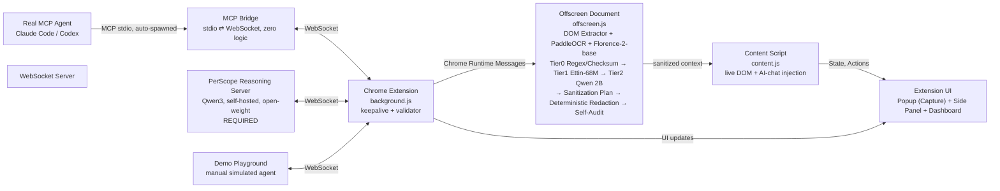

# PerScope — Locked Architecture (v3)

> **SIH26171 — On-Device Visual Perception for Light-weight Browser Agents**
> Team Cosmic Crux — v3 update. Three things changed since v2: (1) perception is three parallel extractors, (2) redaction is a three-tier escalation, (3) server-side reasoning is **required**, not optional.

## 0. Locked Architecture



**Three callers, one validator, one schema.** Demo Playground, MCP Bridge (real agent), and PerScope Reasoning Server all speak the identical `{id, tool, params}` WebSocket schema. The extension cannot tell them apart — that is the point.

### What changed vs v2

| Dimension | v2 | v3 |
|---|---|---|
| Perception | Single small VLM (Moondream/SmolVLM) | **Three parallel extractors**: DOM Extractor (native, no model) + PaddleOCR (text+boxes+confidence) + Florence-2-base (caption, grounding, layout) |
| Redaction | Regex + optional NER | **Three-tier escalation**: Tier0 Regex/Checksum → Tier1 Ettin-68M NER → Tier2 Qwen 2B adjudication → **Deterministic Redaction** → **Self-Audit (fail-closed)** |
| Server reasoning | Optional demo | **Required deliverable**: self-hosted Qwen3 family (open-weight) via vLLM/Ollama, constrained to tool schema |
| Tool schema | 5 tools | **7 tools**: `read_page`, `list_interactive_elements`, `click`, `type`, `submit`, `select_option` (new), `scroll` (new, never gated) |
| Offscreen models | 1 | **4** (PaddleOCR, Florence-2, Ettin-68M, Qwen 2B) — DOM Extractor needs no model |

### What is unchanged

- Chrome service workers **must** send keepalive every 20–30s or are killed idle — `background.js` pings `{type:"ping"}` / expects `{type:"pong"}` from day one.
- Service workers **cannot** access WebGPU/DOM — `offscreen.js` is the only host for Transformers.js + ONNX Runtime Web (WebGPU with WASM fallback).
- `content.js` is the **only** component touching live DOM — now also owns AI-chat-tab injection.
- `minimum_chrome_version: 116` required for WebSocket-in-service-worker.

### Open team decisions (do not adopt silently)

- **Firefox:** PS says "chrome, Firefox". Decide: build real Firefox support or state **Chrome-first, Firefox-compatible architecture (not validated)** on stage.
- **Face redaction:** PS names "blurring faces" explicitly. Current pipeline is text/PII-only. Decide: add lightweight face detection (e.g. BlazeFace/MediaPipe) in perception, or list as **known limitation** — do not leave silent.

## 1. End-to-End Flow

```
1. Inputs — DOM snapshot + screenshot (active tab)
2. Local Perception — DOM Extractor + PaddleOCR (text/boxes/confidence) + Florence-2-base
3. Tier0 Regex/Checksum — DOM matches trusted directly; OCR matches trusted only at high confidence, else escalate (never silently clear)
4. Tier1 Ettin-68M NER — runs only on residual text; output is CANDIDATES, not auto-redactions
5. Tier2 Qwen 2B — adjudicates ambiguous candidates via context → internal Sanitization Plan (never transmitted)
6. Deterministic Redaction — DOM values only + image-region masking via bboxes (OpenRedaction patterns)
7. Self-Audit — re-run Tier0+Tier1 on OUTPUT payload; fail-closed (block + log) if anything remains
 ─ ─ ─ ─ ─ ─ ─ ─ ─ TRUST BOUNDARY ─ ─ ─ ─ ─ ─ ─ ─ ─
8. Sanitized Context (DOM + optional image/Visual) → Server
9. Server Reasoning (Qwen3, open-weight, vLLM/Ollama) — constrained to 7-tool schema via structured/function-calling; multi-turn (action or request for more evidence like scroll)
10. Action Validator — isDestructive() gates every action (server/MCP/Playground/prompt-injection all identical)
11. content.js executes validated action → loop to 1
```

**Core principle enforced throughout:** *We change content, not structure — structure, semantics, relationships intact; only sensitive values replaced.*

## 2. Perception — Three Extractors

| Extractor | Output | Confidence | Owner |
|---|---|---|---|
| **DOM Extractor** | elements, attributes, ARIA labels, bboxes, relationships | n/a (native) | Person 2 |
| **PaddleOCR** (`ppu-paddle-ocr`, `V6_SMALL_MODEL`) | text, bboxes, **per-token confidence** | 0–1 per token | Person 2 — downstream Tier0 depends on this score |
| **Florence-2-base** (`onnx-community/Florence-2-base`) | `<MORE_DETAILED_CAPTION>`, dense grounding, layout | caption confidence | Person 2 — experimental ONNX/browser support, fallback = DOM+OCR only |

All three must match Person 1's schema exactly; bbox conventions (viewport vs. page) must be reconciled explicitly. Test WebGPU + WASM fallback per-model, benchmark combined.

## 3. Tiered Detection & Redaction

```
Tier0: Regex + checksum (OpenRedaction base)
  ├─ DOM value → match + checksum pass → redact immediately
  ├─ OCR text, high confidence + checksum pass → redact
  └─ OCR low confidence OR checksum fail → ESCALATE (never clear)

Tier1: Ettin-68M NER (kalyan-ks/ettin-68m-nemotron-pii, 55 types, 68M)
  └─ runs only on residual → outputs candidates: {type, span, context}

Tier2: Qwen 2B (Qwen/Qwen3.5-2B, Apache 2.0) — local adjudication
  └─ prompt: candidate + DOM role + page section + OCR confidence
  └─ output: Sanitization Plan {spans → replacements} — internal only

Deterministic Redaction (non-model)
  ├─ DOM: value replacement, IDs/classes/roles untouched
  └─ Image: bbox masking (black/blur) via Sharp-equivalent

Self-Audit
  └─ re-run Tier0+Tier1 on OUTPUT → if hit → block payload, log, fail-closed
```

Password-field masking: separate, always-on, outside tiering.

Face detection: **gap** — add or explicitly defer (see Limitations).

## 4. Extension Components

| Component | File | Responsibility |
|---|---|---|
| `background.js` | `extension/background/background.js` | WS client (3 callers multiplexed), 20s keepalive, routing by `id`/`type`, `isDestructive()`, `pendingActions: Map<pending_id>`, `chrome.offscreen` lifecycle |
| `offscreen.js` | `extension/offscreen/offscreen.js` | Hosts 4 models via Transformers.js + ORT Web; message handler for `CAPTURE`/`DETECT`/`REASON` |
| `content.js` | `extension/content/content.js` | Only live-DOM access; `list_interactive_elements`, `click`/`type`/`submit`/`select_option`/`scroll`, reports state; also Chat Injection Layer |
| Popup | `extension/popup/` | Tab selector, Capture, live progress, Capture Review (Visual+Context, clean/ambiguous/blocked), Send / Send & Submit |
| Side Panel | `extension/sidepanel/` | Live view + Approve/Deny for blocked actions |
| Dashboard | `extension/dashboard/` | Privacy Log (redactions per capture: source, count/type, destination) + Security Log (blocked+confirm outcomes), Clear All |
| Chat Injection | `extension/content/chat-adapters/` | Tab discovery for ChatGPT/Claude/Gemini, 2–3 per-site adapters + clipboard fallback, via `content.js` |

Manifest additions: `permissions: ["tabs","scripting","offscreen"]`, `host_permissions: ["<all_urls>"]`, `minimum_chrome_version: "116"`. Firefox: manifest v3 with `browser_specific_settings`.

## 5. Server, Bridge, Playground

| Component | Path | Notes |
|---|---|---|
| **Playground** | `playground/` | Node WS client, scripted demo, "what agent sees" panel |
| **MCP Bridge** | `bridge/` | Thin stdio⇄WebSocket translator, zero logic, auto-spawned; translates `tools/call` ↔ `{id,tool,params}` |
| **Reasoning Server** | `server/` | Self-hosted Qwen3 (vLLM/Ollama), constrained to 7-tool schema via function-calling; supports `scroll`-then-re-evaluate multi-turn; rented GPU for SIH latency is permitted and must be stated |

Bridge gap: MCP `tools/call` is request/response only — cannot carry unsolicited `action_update` push. Decision before finals: **polling tool `check_pending_action`** vs **held-open response** (if transport allows).

## 6. Tool Schema & Security

See `tool-schema.md` for the seven tools. All callers use:
```
{id:"req_123", tool:"click", params:{element_id:"el_3"}}
→ {id:"req_123", status:"ok"} | {id:"req_123", status:"blocked", reason, pending_id} | {status:"error", reason:"stale_element"}
+ unsolicited: {type:"action_update", pending_id, status:"ok"|"denied"|"timeout"}
+ keepalive: {type:"ping"} ↔ {type:"pong"}
```
Validator: identical for server/MCP/Playground/injected text. Never send/store raw screenshot.

## 7. Build Order (summary)

Full time-boxed order in `build-order.md`. MVP: three extractors (Florence degradable), Tier0+Tier1 (Tier2 degradable to conservative default), deterministic redaction + self-audit, validator, and a **minimal working Reasoning Server** — Human Mode Capture is first cut if time runs short.

## 8. Limitations (honest)

- Face blurring: not yet implemented (text/PII only).
- Florence-2 ONNX browser support: experimental.
- Firefox: architecture compatible, not validated.
- Qwen 2B adjudication: requires offscreen memory profiling.
- See `limitations.md` for full list.

## 9. References

- Transformers.js Chrome Extension — `huggingface.co/blog/transformersjs-chrome-extension` — offscreen+WebGPU pattern (community-proven, not official HF Gemma extension).
- PaddleOCR.js — ONNX+WASM/WebGPU in-browser OCR.
- Ettin-68M — `kalyan-ks/ettin-68m-nemotron-pii`.
- OpenRedaction — `sam247/openredaction` (Tier0 base).
- MCP — `modelcontextprotocol.io/specification/2025-06-18/architecture`.
- Qwen3.5-2B — `Qwen/Qwen3.5-2B` (Apache 2.0); server Qwen3 via vLLM/Ollama.
