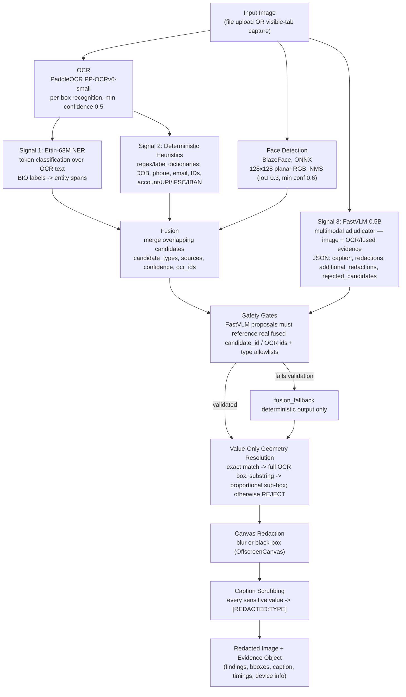
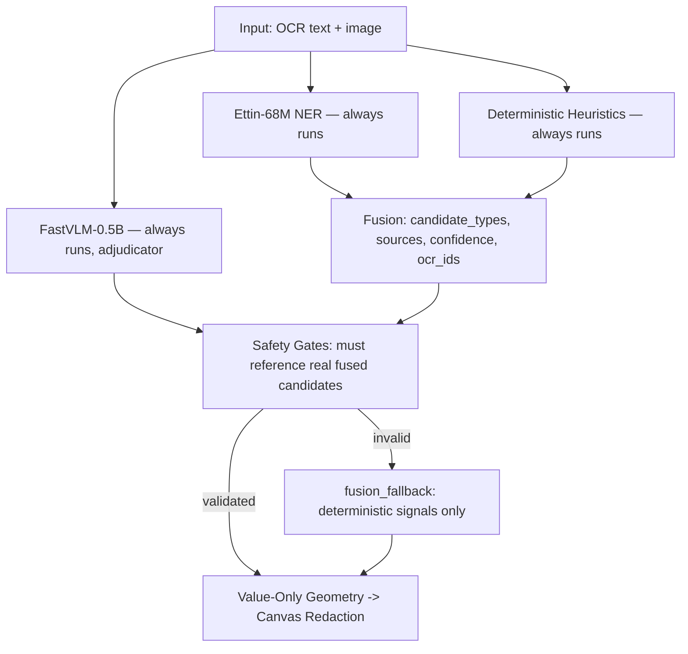

# PerScope — Final Architecture (v4, Tested)

> **SIH26171 — On-Device Visual Perception for Light-weight Browser Agents**
> Team Cosmic Crux — v4. Supersedes v3 (DOM + PaddleOCR + Florence-2-base, tiered escalation regex → Ettin → Qwen 2B) and all earlier drafts.
> **Read Sections 1–3 as tested ground truth. Read Sections 4–6 as intended design (planned, not yet built).**

## 0. Status — What's Tested vs. What's Still Planned

| Layer | Status |
|---|---|
| Perception (face + OCR) | **Tested** — BlazeFace + PaddleOCR, ONNX, on-device |
| PII detection & fusion | **Tested** — NER + heuristics + FastVLM adjudication, fused |
| Redaction (value-only geometry + canvas) | **Tested** — most validated part of the system |
| Safety gates / fail-closed | **Tested** — unvalidated model output → `fusion_fallback`, never blind trust |
| Caption scrubbing | **Tested** — `[REDACTED:TYPE]` before UI/evidence |
| Action validator / confirm flow | **Planned** — no WS client, no `content.js` action layer in tested build |
| Reasoning Server / MCP bridge / Playground | **Planned** — tested build is local-only; nothing crosses a trust boundary yet |
| DOM-based extraction | **Superseded** — tested pipeline works on images, not live DOM |

## 1. End-to-End Flow — As Tested

- All models on-device — WebGPU with WASM/CPU fallback, no cloud calls.
- Core principle (tested reading): layout and non-sensitive content stay intact; only value pixel regions are covered. Value-only, never whole-line.
- Self-audit (re-scan output payload) has **not** been re-implemented on the new pipeline — the tested equivalent is **caption scrubbing**. Explicit decision needed whether output-level self-audit is still required on top.

### What changed vs v3

| Dimension | v3 (planned) | v4 (tested) |
|---|---|---|
| Input | DOM snapshot + screenshot | **Image only** (upload or visible-tab capture) |
| Perception | DOM Extractor + PaddleOCR + Florence-2-base | **BlazeFace + PaddleOCR + FastVLM-0.5B** |
| PII detection | Sequential tiers: regex → Ettin (residual) → Qwen 2B (ambiguous only) | **Parallel fusion**: Ettin + heuristics + FastVLM all run, then fused + gated |
| Adjudication | Qwen3.5-2B plans, deterministic redactor executes | **FastVLM-0.5B proposes, safety gates validate, fallback on failure** |
| Faces | Open gap | **Solved via BlazeFace** |
| Geometry | Whole-box masking | **Value-only chokepoint** (exact / proportional-sub-box / reject) |
| Server reasoning | Qwen3 family | **Model TBD, explicitly not Qwen** |
| Qwen lineage | Qwen 2B on-device + Qwen2.5/3 server | **Qwen dropped entirely, both sides** |

## 2. Detection — Parallel Fusion, Not Sequential Escalation

FastVLM is a source that must earn trust against independently existing evidence — never the last word. Deterministic + NER signals are never blocked by a FastVLM failure because they never waited on it.

## 3. Extension Components

Tested structure: `popup.html`/`dashboard.html` → `background/service-worker.js` → `offscreen.html`/`offscreen.js` → `src/pipeline/` → `src/popup/`.

| Component | File | Responsibility | Status |
|---|---|---|---|
| `background.js` | `extension/background/background.js` | WS client (3 callers), 20s keepalive, routing, `isDestructive()`, `pendingActions` | **Planned** — tested SW: offscreen lifecycle + tab capture only |
| `offscreen.js` | `extension/offscreen/offscreen.js` | Hosts **BlazeFace, PaddleOCR, Ettin-68M, FastVLM-0.5B** via Transformers.js + ORT Web; idle pre-warm NER + FastVLM | **Tested** |
| `content.js` | `extension/content/content.js` | Only live-DOM access; actions + chat injection | **Planned** |
| Popup | `extension/popup/` | Tab selector, Capture, progress, Review (Visual+Context, clean/ambiguous/blocked), Send / Send & Submit | **Partially tested** (upload/capture/device-tier/progress exist; Send-to-Chat planned) |
| Side Panel | `extension/sidepanel/` | Live view + Approve/Deny | **Planned** (tested equiv: dashboard bbox-overlay review) |
| Dashboard | `extension/dashboard/` | Privacy Log + Security Log, redacted-only, Clear All | **Partially tested** (telemetry/evidence/export exist; two-log structure planned) |
| Chat Injection | `extension/content/chat-adapters/` | Tab discovery, per-site adapters, via `content.js` | **Planned** |

Manifest: `minimum_chrome_version: "116"` (for future WS keepalive). Tested MV3 manifest loads ORT WASM from `chrome.runtime.getURL("ort/")`, not CDN (MV3 CSP). Chrome-only; no Firefox claim without testing.

## 4. Tool Schema & Security (planned action layer — contract locked)

See `tool-schema.md` for the seven tools (`read_page`, `list_interactive_elements`, `click`, `type`, `submit`, `select_option`, `scroll`). All callers use `{id, tool, params}` ↔ `{id, status:"ok"|"blocked"|"error"}` + unsolicited `{type:"action_update", pending_id, ...}` + `{type:"ping"}` ↔ `{type:"pong"}`. Validator identical for server/MCP/Playground/injected text. Never send/store raw screenshot. MCP `tools/call` cannot carry unsolicited push — gap tracked in `tool-schema.md` (polling `check_pending_action` vs held-open response, undecided).

## 5. Server, Bridge, Playground (planned — required, not built)

| Component | Path | Notes |
|---|---|---|
| **Playground** | `playground/` | Node WS client, scripted demo, "what agent sees" panel |
| **MCP Bridge** | `bridge/` | Thin stdio⇄WebSocket translator, zero logic, auto-spawned |
| **Reasoning Server** | `server/` | **Model TBD, explicitly not Qwen** — open-weight, self-hostable via vLLM/Ollama; rented GPU for SIH latency permitted and must be stated; constrained to 7-tool schema via function-calling; multi-turn (`scroll`-then-re-evaluate) |

## 6. Human Mode (planned)

Popup Capture flow + Capture Review (Visual + Context) + Send vs Send & Submit + destination picker + wrapper text — see root README § Two Products. First-class product surface, same pipeline and trust boundary, person instead of model deciding invocation.

## 7. Limitations (honest — tested)

- FastVLM-0.5B small: bland captions, occasional JSON-schema misses — survives via fallback.
- Heuristics can over-redact at edges (safe-direction tradeoff).
- WASM fallback single-threaded (int64 crash on threaded build) — slow CPU inference; demo on WebGPU hardware.
- Server / action layer / Send-to-Chat / per-site adapters: not built.
- Firefox: architecture-compatible, not validated.
- See `limitations.md` for full list.

## 8. References

- Transformers.js Chrome Extension — `huggingface.co/blog/transformersjs-chrome-extension`.
- PaddleOCR.js — ONNX+WASM/WebGPU in-browser OCR.
- Ettin-68M-Nemotron-PII ONNX — `huggingface.co/rulesentry-io/ettin-68m-nemotron-pii-onnx`.
- BlazeFace ONNX — `huggingface.co/garavv/blazeface-onnx`.
- FastVLM-0.5B ONNX — `huggingface.co/onnx-community/FastVLM-0.5B-ONNX`.
- OpenRedaction — `sam247/openredaction` (historical Tier0 base; heuristics now own this role).
- MCP — `modelcontextprotocol.io/specification/2025-06-18/architecture`.
